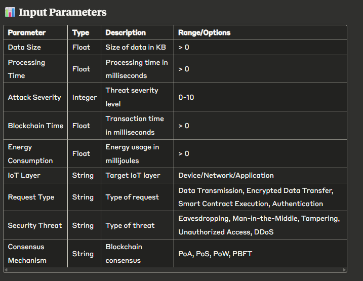

🛡️ IoT Threat Shield - ML-Based Threat Mitigation System
An AI-powered web application for IoT security threat detection and mitigation using machine learning algorithms and blockchain technology.

🚀 Features
Real-time Threat Detection: Advanced ML algorithms analyze IoT system parameters
Interactive Web Interface: Modern, responsive UI with real-time feedback
Blockchain Integration: Secure transaction processing with multiple consensus mechanisms
Multi-layer Analysis: Device, Network, and Application layer security assessment
Comprehensive Reporting: Detailed analysis reports with actionable recommendations
REST API: Programmatic access to threat prediction capabilities

📋 Prerequisites
Python 3.8 or higher
pip (Python package installer)
Virtual environment (recommended)

🛠️ Installation
1. Clone the repository
    git clone <https://github.com/Rakib5032/ML-Web-App.git>
    cd ml_web_app

2. Create a virtual environment

    python -m venv venv

3. Activate the virtual environment
    
    On Windows:
    venv\Scripts\activate

    On macOS/Linux:
    source venv/bin/activate

4. Install dependencies
    
    pip install -r requirements.txt

5. lace your trained models
    
    Ensure random_forest_model.pkl is in the models/ directory
    Ensure preprocessor.pkl is in the models/ directory

🚀 Running the Application
1. Start the Flask development server
    
    python app.py

2. Open your web browser and navigate to:
    
    http://localhost:5000

📁 Project Structure

ml_web_app/
│
├── app.py
|
├── requirements.txt
|
├── models/
|   |
│   ├── random_forest_model.pkl
│   └── preprocessor.pkl
|
├── templates/
|   |
│   ├── index.html
│   └── result.html
├── static/
|   |
│   ├── style.css 
│
└── README.md

🎯 How to Use

Web Interface

1. Navigate to the home page
2. Fill in the IoT system parameters:

Data Size (KB)
    Processing Time (ms)
    Attack Severity (0-10 scale)
    Blockchain Transaction Time (ms)
    Energy Consumption (mJ)
    IoT Layer (Device/Network/Application)
    Request Type
    Security Threat Type
    Consensus Mechanism

3. Click "Analyze Threat Level"
4. View the detailed results with:
    Threat status (Mitigated/Detected)
    Confidence percentage
    Recommendations
    Security best practices

REST API
Send POST requests to /api/predict with JSON data:

curl -X POST http://localhost:5000/api/predict \
  -H "Content-Type: application/json" \
  -d '{
    "data_size": 1024,
    "processing_time": 250,
    "attack_severity": 5,
    "blockchain_time": 500,
    "energy": 150,
    "iot_layer": "Device",
    "request_type": "Data Transmission",
    "threat_type": "Eavesdropping",
    "consensus": "PoA"
  }'

🔧 Configuration
Environment Variables
You can set the following environment variables:

FLASK_ENV: Set to development for development mode
FLASK_DEBUG: Set to 1 to enable debug mode
PORT: Port number for the application (default: 5000)
Model Files
The application expects the following files in the models/ directory:

random_forest_model.pkl: Trained Random Forest model
preprocessor.pkl: Data preprocessing pipeline
If these files are not found, the application will use a fallback prediction method.

🎨 Features Overview
🎯 Threat Assessment
    Real-time analysis of IoT security parameters
    ML-based threat prediction with confidence scores
    Multi-factor security evaluation

Set environment variables:

export FLASK_ENV=production
export FLASK_DEBUG=0

🤝 Contributing
Fork the repository
Create a feature branch
Make your changes
Add tests if applicable
Submit a pull request

📄 License
This project is licensed under the MIT License - see the LICENSE file for details.

🆘 Support
For support, please:

Check the documentation
Review existing issues
Create a new issue with detailed information

🔮 Future Enhancements
    Real-time monitoring dashboard
    Advanced ML model ensemble
    Integration with IoT device APIs
    Historical threat analytics
    Advanced user authentication
    Multi-tenant support
    Docker containerization
    Cloud deployment templates
 

Made with ❤️ for IoT Security

